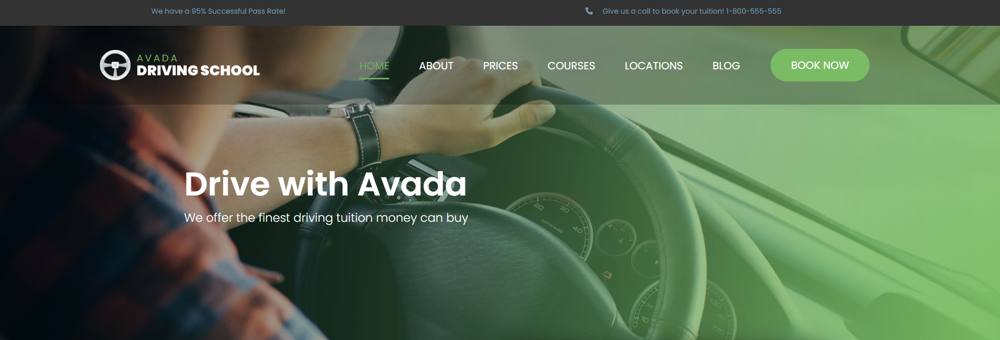
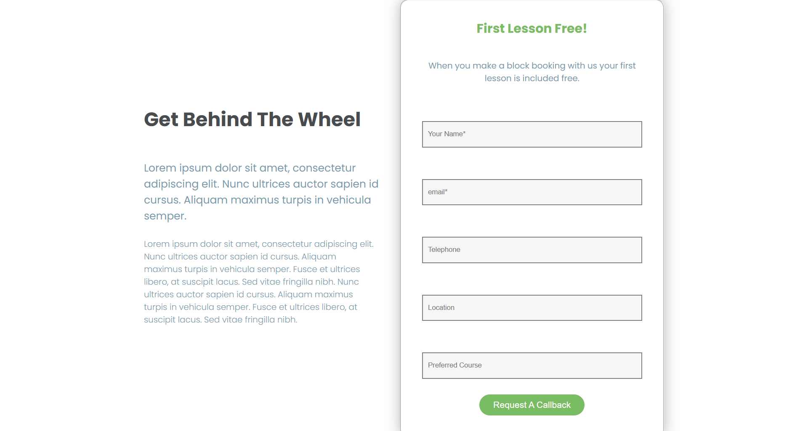
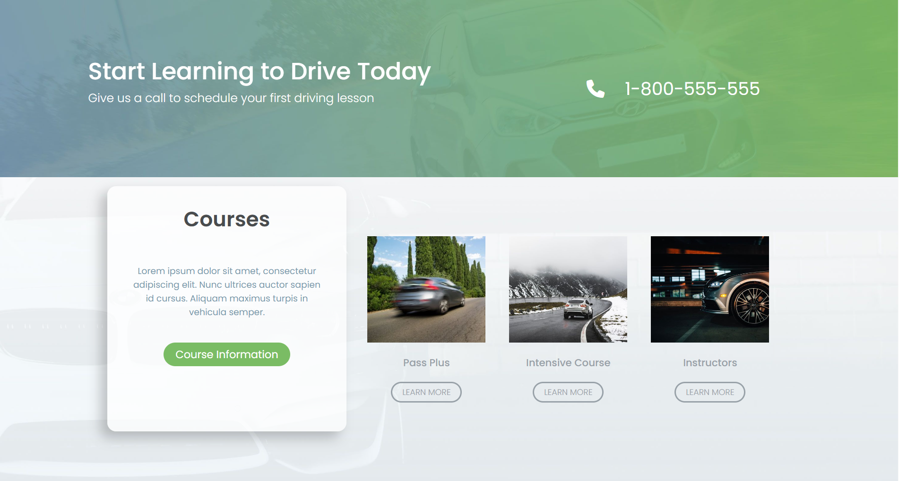
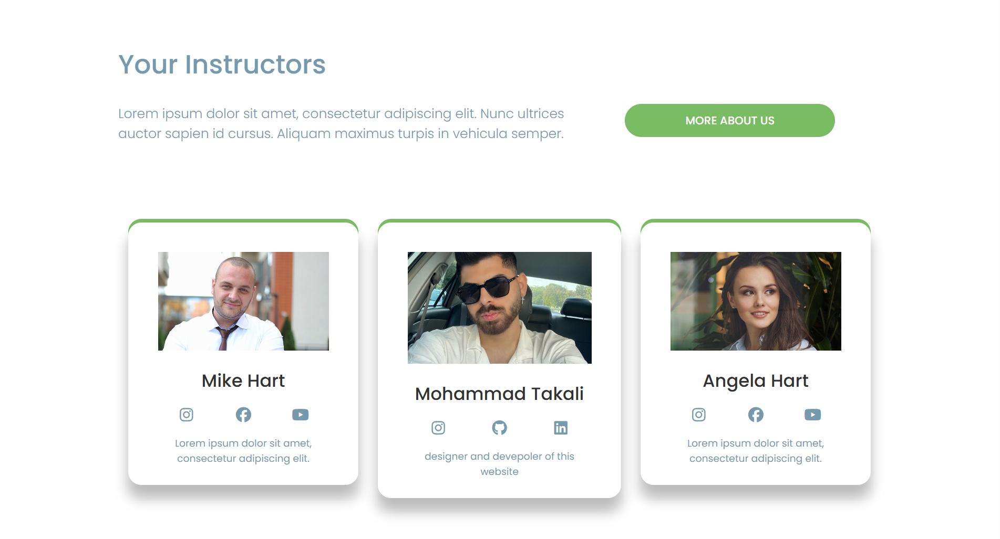
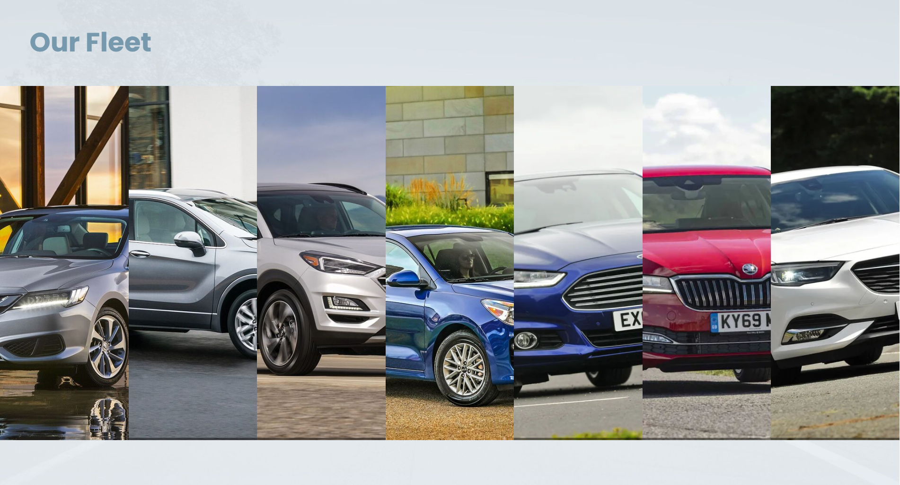

# 🚗 Driving School Website

A complete front-end build of a driving school platform, from hero section to footer — HTML5, CSS3 (Flexbox, Nesting).

- 🔗 [Live Demo](https://mohammadtakali.github.io/driving-school-website/)
- 👨‍💻 Developed by **Mohammad Takali**
- 📅 Created - 2026-09-11
- 🛠️ Technologies Used - HTML, CSS
- 🎯 Role - Frontend Developer
- 📬 How to reach me: [Instagram](https://www.instagram.com/mohammadtakali.dev) · [GitHub](https://github.com/mohammadtakali) · [LinkedIn](https://www.linkedin.com/in/mohammad-takali-b9b820434)

## ✨ Features

- Full-height hero section with background image and call-to-action
- Top announcement bar with promotional messages
- Header with logo, dropdown navigation menu, and a "Book Now" call-to-action button
- Lead capture form for booking a free first lesson
- Courses showcase section (Pass Plus, Intensive Course, Instructors)
- Instructor profile cards with social links
- Vehicle fleet gallery with hover-expand image panels
- Footer section with profile photo and social links (Instagram, GitHub, LinkedIn)
- Google Fonts (Poppins, Lavishly Yours) and Font Awesome icons
- Fully responsive layout built with Flexbox
- Written with modern native CSS nesting

## 🧰 Built With

- **HTML5**
- **CSS3** — Flexbox, CSS Nesting, Custom Properties, Transitions
- **Font Awesome** — icon library
- **Google Fonts** — Poppins, Lavishly Yours

## 🖼️ Preview

**Hero Section**

**Booking Form**

**Courses**

**Instructors**

**Our Fleet**

**Footer**

## 📄 License

This project is licensed under the MIT License — see the [LICENSE](LICENSE) file for details.
